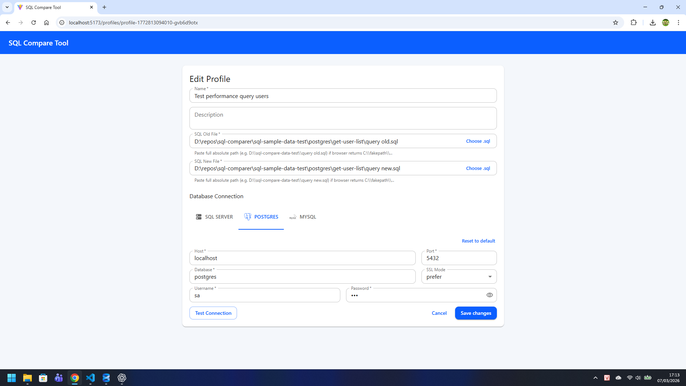
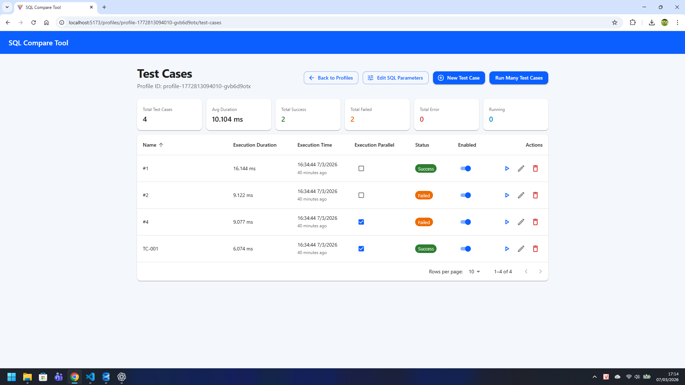
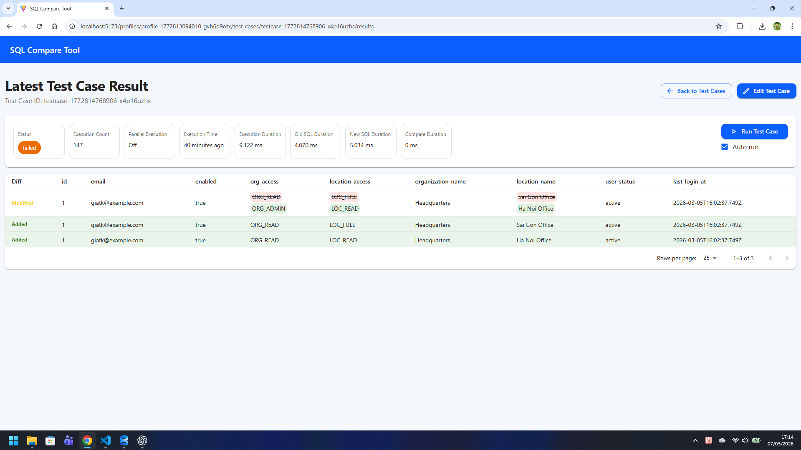

# SQL Comparer

English | [Tiếng Việt](documents/vi/README.md) | [日本語](documents/jp/README.md)

SQL Comparer is a web-based tool for validating whether a new SQL query returns the same data as an old SQL query across multiple test cases.

It is designed for database refactoring, migration validation, performance comparison, and regression checking.

## What It Does

- Manage database connection profiles for different providers
- Store two SQL files per profile: `old` and `new`
- Define reusable SQL parameters and test cases
- Run one test case or many test cases
- Compare query results and generate diff artifacts
- Keep execution history, durations, statuses, and error details
- Auto-run a test case when SQL files change

## Supported Providers

- SQL Server
- PostgreSQL
- MySQL

## Main Concepts

### Profile

A profile contains:

- provider information
- database connection settings
- path to `old.sql`
- path to `new.sql`

### SQL Parameter

A SQL parameter defines the input schema used by test cases, for example:

- `id`
- `email`
- `enabled`

### Test Case

A test case contains:

- test case name
- parameter payload as JSON
- execution settings such as:
  - compare in order
  - parallel execution
  - auto run when SQL changes

## How It Works

1. Create a profile
2. Configure the database connection
3. Select the old and new SQL files
4. Define SQL parameters
5. Create test cases
6. Run a test case or run many test cases
7. Review the latest result and generated diff files

## Result Artifacts

Each execution stores result files under `server/data/results/...`.

Typical output includes:

- `old-result.json`
- `new-result.json`
- `diff-result.json`
- `data/parameter.json`
- `data/test-case.json`
- `data/old.sql`
- `data/new.sql`

## Project Structure

```text
sql-comparer/
├── client/                  # React + Vite frontend
├── server/                  # Express + TypeScript backend
├── sql-sample-data-test/    # Sample SQL scripts for supported providers
└── documents/               # Multi-language documentation
```

## Local Development

### Install dependencies

```bash
cd server && npm install
cd ../client && npm install
```

### Run in development mode

From the repository root:

```bash
npm run dev
```

Default URLs:

- Frontend: `http://localhost:5173`
- Backend: `http://localhost:5000`
- Swagger: `http://localhost:5000/api-docs`

## Build and Serve

Build both backend and frontend:

```bash
npm run build
```

Run the built output:

```bash
npm run serve
```

Serve mode uses:

- `server/dist/index.js` for the backend
- `client/dist` through `vite preview` for the frontend

## Demo Data

The repository includes sample SQL files for:

- PostgreSQL
- SQL Server
- MySQL

See:

- [documents/README.md](documents/README.md)
- `sql-sample-data-test/`

## Documentation

- [Documentation Index](documents/README.md)
- [Vietnamese Guide](documents/vi/README.md)
- [Japanese Guide](documents/jp/README.md)
- [Server Architecture Notes](server/docs/REPOSITORY_PATTERN.md)

## Current Stack

- React
- Vite
- Material UI
- Express
- TypeScript
- JSON file storage for metadata
- `mssql`, `pg`, `mysql2` for database access

## Screenshots







## Notes

- SQL metadata is stored in JSON files, not in a tool database
- Query result comparison can ignore row order or enforce row order per test case
- SQL Server Windows Authentication depends on the host machine driver environment
